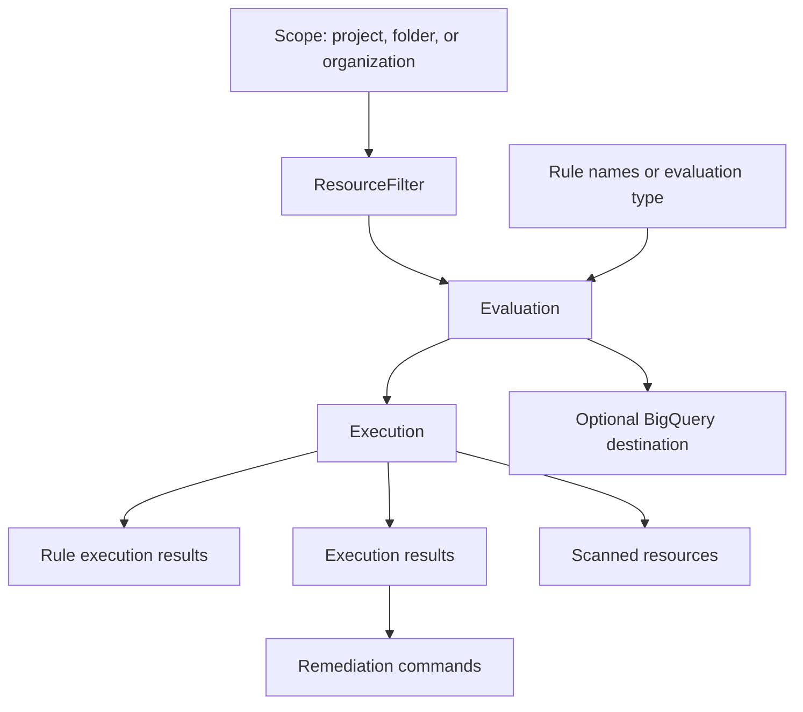

# Workload Manager Core Concepts

Workload Manager provides validation and automation tooling for enterprise
workloads on Google Cloud. Public documentation describes it as a service for
automating workload deployment and validating workloads against best practices
and recommendations.

## Resource Model

## Main Resources

-   **Evaluation**: Configuration that defines what to validate. It includes a
    resource filter, workload evaluation type, rule names, labels, optional
    fixed schedule, optional custom rules bucket, optional BigQuery destination,
    and optional CMEK key.
-   **Rule**: A best-practice check with display name, severity, categories,
    remediation text, tags, and asset type.
-   **Execution**: A run of an evaluation. Executions expose state, timing,
    engine, run type, rule results, notices, external data sources, and summary
    counts.
-   **ExecutionResult**: A finding or remediation result from an execution,
    including rule, severity, violation message, documentation URL, affected
    resource, details, and suggested commands.
-   **ScannedResource**: A resource scanned by an execution, optionally filtered
    by rule.

## Evaluation Types

The public v1 client libraries expose these evaluation types:

-   `SAP`: SAP best practices.
-   `SQL_SERVER`: SQL Server best practices.
-   `OTHER`: General Google Cloud best practices and custom organizational
    best-practice rules.

Use `list_rules` with an evaluation type before creating an evaluation. This
keeps the selected rule names aligned with the workload type and current public
rule catalog.

For `OTHER`, start by listing the available rules in the target location. Use
the built-in general best-practice catalog for baseline cloud posture checks,
and use `custom_rules_bucket` only when evaluating Rego rules uploaded to Cloud
Storage. See [General Best Practices](general-best-practices.md) for selection
patterns.

## Evaluation Scope

Use `ResourceFilter` to constrain blast radius:

-   `scopes`: `projects/{project_id}`, `folders/{folder_id}`, or
    `organizations/{organization_id}`.
-   `resource_id_patterns`: Regular-expression style resource ID patterns.
-   `inclusion_labels`: Required labels that must be present on included
    resources.
-   `gce_instance_filter.service_accounts`: Limits Compute Engine instances to
    selected service accounts.

Prefer the smallest project or label-filtered scope that answers the question.
Folder or organization scopes need broader permissions and can produce more
results, more logs, and more BigQuery export data.

## Scheduling

`Evaluation.schedule` accepts fixed cron strings documented in the client
libraries:

-   `0 */1 * * *`: hourly
-   `0 */6 * * *`: every 6 hours
-   `0 */12 * * *`: every 12 hours
-   `0 0 */1 * *`: daily
-   `0 0 */7 * *`: weekly
-   `0 0 */14 * *`: every 14 days
-   `0 0 1 */1 *`: monthly

If a user needs an ad hoc run, use `run_evaluation` instead of adding a
schedule.

## Public Surface Boundaries

The Python client library package `google-cloud-workloadmanager` and generated
Go client cover evaluation workflows: evaluations, executions, execution
results, rules, and scanned resources.

The REST reference may expose additional resources, such as deployments,
actuations, discovered profiles, insights, and operations. When a needed
resource is not available in a client library, use the REST API directly and
keep the request shape close to the REST reference.
