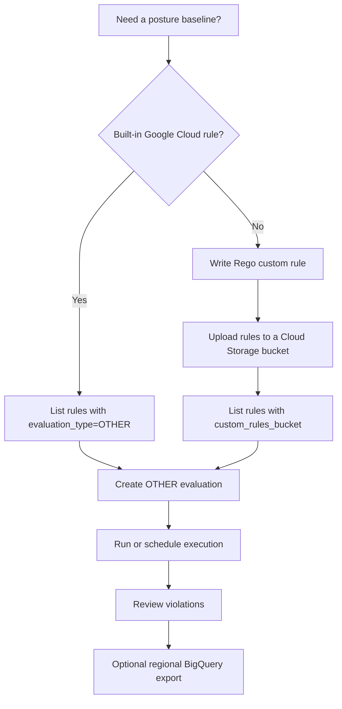

# Workload Manager General Best Practices

Use this reference when a user asks for Google Cloud general best-practice
posture checks, cloud security posture management, FinOps posture, reliability
posture, or custom organizational rules. In client library automation, use
`OTHER` for this general/custom rule path and verify the available rules by
listing them in the target location.

## Decision Flow

## Built-In General Best Practices

The Google Cloud best-practices reference is the source of truth for the public
general catalog. It covers cross-product rules and assigns severities to
non-compliant resources.

Use the catalog for baseline posture checks across:

-   API keys
-   AlloyDB
-   BigQuery
-   Cloud Billing
-   Cloud DNS
-   Cloud KMS
-   Cloud Pub/Sub
-   Cloud SQL
-   Cloud Storage
-   Compute Engine
-   Filestore
-   Google Kubernetes Engine
-   Identity and Access Management
-   Memorystore for Redis Cluster
-   OS Config and VM Manager
-   Resource Manager
-   Secret Manager
-   Spanner
-   Vertex AI
-   Vertex AI Workbench

Treat the online catalog as dynamic. Agents should list rules from the API in
the target project and location before creating evaluations, then select rules
by rule name, asset type, severity, and tags.

## Severity Guidance

Use severity to prioritize remediation:

-   `CRITICAL`: address immediately when the finding can affect availability,
    data integrity, or supported configuration.
-   `HIGH`: plan remediation in the next maintenance window.
-   `MEDIUM`: queue remediation for near-term operational hardening.
-   `LOW`: use as posture signal, cleanup, or governance reporting.

## Posture Themes

The general catalog and posture-management guidance are useful across three
operational themes:

-   **Security**: public exposure, API key restrictions, default service account
    use, external IP exposure, CMEK, certificate state, and IAM hygiene.
-   **Reliability**: backups, point-in-time recovery, automatic storage growth,
    maintenance policies, unsupported settings, and resource health.
-   **FinOps**: labels and tags, lifecycle settings, storage expiration,
    oversized or under-governed resources, and historical trend tracking.

Start with a small baseline rule set that answers the immediate posture
question. Expand by tag or asset category once the first execution output is
well understood.

## Custom Organizational Rules

Use custom rules when the built-in catalog does not encode an internal mandate.
Workload Manager custom rules use Rego. In client library automation, list them
through the `OTHER` rule path with `custom_rules_bucket`.

Common custom-rule use cases:

-   Require labels such as `CostCenter`, `Owner`, or `Environment`.
-   Disallow resources in unapproved regions.
-   Block Compute Engine default service account usage.
-   Require private-only VMs or disallow external IP addresses.
-   Enforce organization-specific tagging, network, or backup conventions.

Custom rule metadata should include:

-   `DETAILS`: short description of the policy.
-   `SEVERITY`: user-defined severity such as `CRITICAL`, `HIGH`, `MEDIUM`, or
    `LOW`.
-   `ASSET_TYPE`: supported Cloud Asset Inventory asset type.
-   `TAGS`: rule filter tags.

## Custom Rule Evaluation Notes

-   Upload custom Rego files to a Cloud Storage bucket and pass that bucket as
    `custom_rules_bucket`.
-   Enable Service Usage API and Cloud Monitoring API in the project where the
    custom-rule evaluation is created and run.
-   List rules from the bucket before creating the evaluation.
-   Keep evaluations scoped to the smallest project, folder, organization, label
    set, or resource ID pattern that answers the question.
-   Split large custom catalogs across evaluations when needed; public docs list
    a maximum of 300 custom rules per evaluation.
-   BigQuery result exports for custom rules must use regional datasets, not
    multi-region datasets.

## Operational Pattern

1.  Run a manual General Best Practices scan to establish baseline posture.
2.  Triage critical and high findings first, grouped by asset type and owner.
3.  Add a daily or weekly schedule only after rule scope and alert volume are
    validated.
4.  Export results to a regional BigQuery dataset when historical trend analysis
    or dashboarding is required.
5.  Add custom Rego rules for internal controls that do not exist in the
    built-in catalog.

Check expected evaluation volume and BigQuery storage/query costs before
enabling frequent schedules or broad organization-wide exports.
