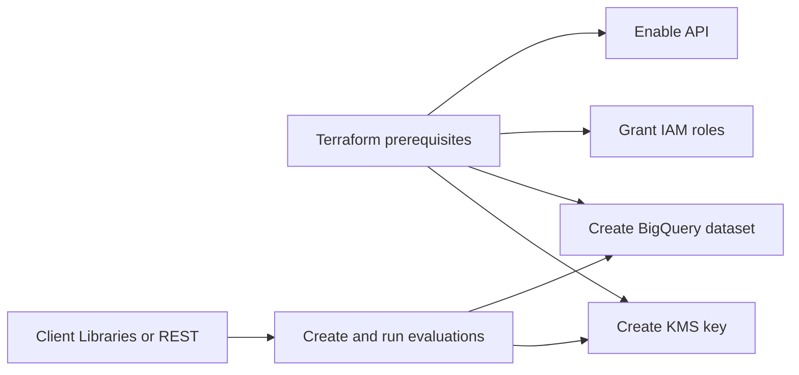

# Workload Manager Setup Prerequisites

This file is not Workload Manager infrastructure-as-code support. Public
Terraform examples here cover only adjacent prerequisites around Workload
Manager: API enablement, IAM, BigQuery export datasets, and KMS keys.

Do not write examples that imply Terraform can manage Workload Manager
evaluations, executions, rules, deployments, actuations, or insights unless a
current provider reference explicitly documents those resources. Manage Workload
Manager resources through public client libraries or the REST API.

## Terraform: Enable API

```terraform
resource "google_project_service" "workload_manager" {
  project            = var.project_id
  service            = "workloadmanager.googleapis.com"
  disable_on_destroy = false
}

resource "google_project_service" "service_usage" {
  project            = var.project_id
  service            = "serviceusage.googleapis.com"
  disable_on_destroy = false
}

resource "google_project_service" "monitoring" {
  project            = var.project_id
  service            = "monitoring.googleapis.com"
  disable_on_destroy = false
}
```

The Service Usage and Cloud Monitoring APIs are required when creating and
running custom-rule evaluations.

## Terraform: Grant Evaluation Admin

```terraform
resource "google_project_iam_member" "workload_manager_evaluation_admin" {
  project = var.project_id
  role    = "roles/workloadmanager.evaluationAdmin"
  member  = "serviceAccount:${google_service_account.automation.email}"
}
```

## Terraform: BigQuery Export Dataset

```terraform
resource "google_bigquery_dataset" "workload_manager_results" {
  project    = var.project_id
  dataset_id = "workload_manager_results"
  location   = var.location
}
```

Reference this dataset from the client libraries or REST API with
`Evaluation.big_query_destination.destination_dataset`. Use a regional dataset
in the same region as the evaluation data; multi-region datasets are not
supported for Workload Manager result exports.

## Terraform: CMEK Prerequisites

```terraform
resource "google_kms_key_ring" "workload_manager" {
  project  = var.project_id
  name     = "workload-manager"
  location = var.location
}

resource "google_kms_crypto_key" "evaluations" {
  name            = "evaluations"
  key_ring        = google_kms_key_ring.workload_manager.id
  rotation_period = "7776000s"
}
```

Reference the key from the client libraries or REST API with
`Evaluation.kms_key` in this format:

```text
projects/PROJECT_ID/locations/LOCATION/keyRings/KEY_RING/cryptoKeys/KEY
```

## Automation Boundary



Keep prerequisite setup and evaluation execution separate. Evaluation runs are
operational actions with long-running operation state, so they fit better in
controlled client library or REST API automation than in a Terraform plan.
